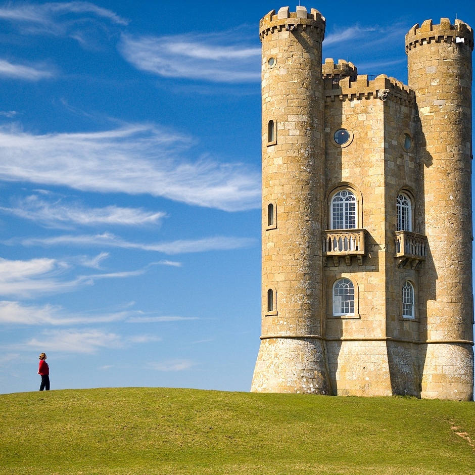

# Parallelized Seam Carver
The aim of this project is to explore the application of general-purpose GPU
computing to seam carve in real-time using dynamic programming. This project was
developed as a focused technical prototype over a weekend. The primary goal was
to explore specific architectural constraints, GPGPU compute and arena-based
memory management, rather than to produce a production-grade image editor. As
such, the scope is intentionally limited to the core dynamic programming algorithm
and systems performance.

[Wikipedia](https://en.wikipedia.org/wiki/Seam_carving) has an in-depth
explanation of what seam carving is. To summarize, seam carving is a content-aware
image resizing technique. It can resize images without distorting important objects.

The basic idea is to pick a method (like gradient magnitude, entropy, etc.)
to assign importance value to each pixel and then locate the least important
seams/paths through the image. Importance values (energies) are updated each
time a seam has been removed from the image to achieve the best
possible result. This is often implemented using dynamic programming.

### Demo


*Broadway tower being carved in real-time with removed seam visualized. [Image](https://commons.wikimedia.org/wiki/File:Broadway_tower_edit.jpg) from Wikimedia Commons.*

### Samples
| Original | Naive Resize | Seam Carving |
| -------- | ------------ | ------------ |
|  1428x968 |  940x940 |  940x940 |
|  800x533 |  400x500 |  400x500 |

## Download
Stable builds can be found on the [releases](https://github.com/Baedrick/gpu-seam-carving/releases)
page. This project is currently tested and supported only on Windows.

## Features
- GPU-Accelerated seam carving algorithm.
  - Energy calculation.
  - Cost accumulation.
  - Seam finding.
  - Seam removal.
- Real-time visualization.
- Performance counters and a plot of GPU compute times.
- Interactive controls.
  - Load/Save images (PNG, JPG, JPEG).
  - Adjust target width and height via sliders.
- Debug visualization.
  - View the raw energy map.
  - Visualize the identified seam during removal.
- Zero-allocation loop.
  - Arena-based memory management.
  - Ping-pong textures to minimize memory allocation overhead during carving.

## Technical Details
The following files are of interest:
- Application: [sc/sc_main.cpp](seam_carving/sc/sc_main.cpp)
- Shaders: [sc/sc_assets.cpp](seam_carving/sc/sc_assets.cpp)

The application uses a multi-pass compute shader approach:
1.  Image Loading: Input images are converted from sRGB space to linear color space.
2.  Energy Calculation: A Sobel filter computes the gradient magnitude (energy) of the image based on luminance.
3.  Cost Map Generation: A compute shader iteratively calculates the cumulative minimum energy matrix (dynamic programming). This is done row-by-row (for vertical seams) or col-by-col (for horizontal seams).
4.  Seam Identification:
    - Reduction: Parallel reduction finds the minimum value in the last row/column to identify the seam end.
    - Backtracing: The path of minimum energy is traced through the cost map.
5.  Seam Removal: Pixels are shifted in parallel to remove the seam, using a ping-pong buffer strategy (read from Source, write to Destination). Two large textures are allocated and used throughout the removal.

The seam carving algorithm relies on dynamic programming to build a cumulative
energy map. This introduces a **strict data dependency**: the cost of a pixel at
row `y` depends entirely on the computed costs of row `y - 1`.
- This dependency forces a sequential dispatch loop on the CPU. For an image with
height $H$, we must issue $H$ separate `glDispatchCompute` calls, each followed by
a `glMemoryBarrier`. This incurs significant CPU driver overhead.
- I tried to mitigate this by using large workgroup sizes (256) to ensure that
despite the serial dispatch, the GPU is saturated with as much work as possible
for the calculation of each row.
- If migrating to CUDA, I would eliminate the CPU loop entirely. I would use
dynamic parallelism, which enqueues on the device (GPU) rather than CPU.

## Dependencies
This project relies on the following external libraries:
- [Argh](https://github.com/adishavit/argh): Command line parsing.
- [Dear ImGui](https://github.com/ocornut/imgui): Immediate mode GUI.
- [glad](https://github.com/Dav1dde/glad): OpenGL function loader.
- [glfw](https://github.com/glfw/glfw): Window & input.
- [glm](https://github.com/g-truc/glm): Linear algebra library.
- [stb_image](https://github.com/nothings/stb): Image loading.
- [stb_image_write](https://github.com/nothings/stb): Image writing.
- [stb_sprintf](https://github.com/nothings/stb): String formatting.

You may need to install [vc++ redistributable](https://learn.microsoft.com/en-us/cpp/windows/latest-supported-vc-redist?view=msvc-170) to run the program.

## Building & Running
This project is configured as a Visual Studio 2022 solution (`.sln`).
1.  Open `seam_carving.sln` in Visual Studio.
2.  Select the build configuration (Debug/Release).
3.  Build and run the solution.

For a list of supported command-line arguments see `--help`. For example:
```
seam_carving.exe --help
```

## Controls
- Load Image: Open the file dialog to select an image.
- Target Width/Height: Drag sliders to set the desired dimensions.
- Carve: Starts the carving process until the target size is reached.
- Reset Image: Restore the original image.
- Debug View: Switch between "None" and "Energy" to see the underlying energy map.
- Show Seam: Toggles the red overlay showing the current seam being removed.
- Tab: Show/Hide the UI.

## AI Usage Declaration
AI was used in the debugging of complex or poorly documented external APIs
(thanks Microsoft).  Otherwise, the source code is written by me and I am proud
to claim that every line of code is my own.

## Acknowledgments
- The original Seam Carving paper by Shai Avidan and Ariel Shamir.

## License
This project is open-source and available under the Apache 2.0 License.
For details, see the accompanying [LICENSE](LICENSE) file in the root of this repository.
